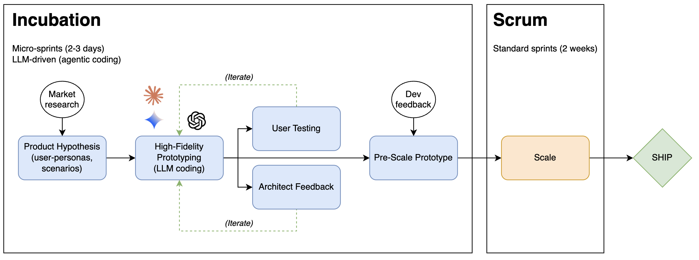
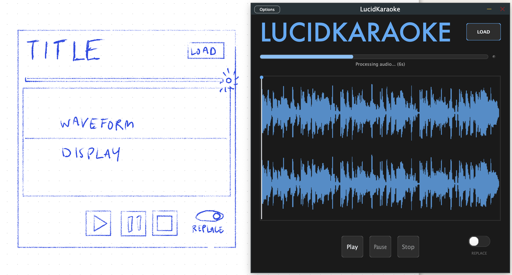

# AI-Driven Product Ownership: A Thought Experiment

The idea of accelerating audio product development with AI has stuck in my mind since our interview. It's an fascinating puzzle with huge potential gains and challenging sub-problems.

I've prepared a few thoughts below on how I might approach this problem.

__Lucid Karaoke__: As a proof of concept, I've also started building out a JUCE prototype that allows the user to sing along to a fully mixed music track, then replace the voice of the singer with their own. See the github repo for the codebase (work in progress).
* https://github.com/maxsolomonhenry/lucidkaraoke

## Problem Statement (High Level)

At the core of this thought experiment are three interconnected questions:

1. How to leverage generative AI to let users __hear and feel__ an audio concept as early as possible, rather than waiting for the first engineering build.

1. How to ensure these rapid prototypes are built on a solid, scalable foundation so that the AI code accelerates, rather than complicates, the final development.

1. _Conviviality:_ How to integrate this approach into the current workflow, such that it __empowers__ the developers and designers, fostering a culture of _shared ownership_ and rapid learning.

## Solutions

* __Solution__: The JUCE C++ framework provides an excellent foundation for functional audio prototypes, with a highly flexible UI and a robust audio engine that is above and beyond traditional wireframe tools. 
    * While traditionally slow, agentic AI makes development in JUCE rapid and simple (see __LucidKaraoke__ repo for proof of concept).

* __Solution__: High-level feedback sessions with a software _architect_ can help align on code organization and scalability during prototype iteration.
    * Programming in a well-known audio framework (JUCE) ensures you're speaking the _lingua franca_ of DSP engineers, who can then grab and scale it.

* __Solution__: Collaborative brainstorming sessions with developers will establish code style and boilerplate and address implementation "gotchas" early, fostering a shared sense of ownership and buy-in before the scaling phase.

### Collaboration is Key
__Collaborative brainstorming__ with subject matter experts (SMEs) is key to alignment and buy-in. As a Product Owner (PO), it is crucial to be curious and humble, allowing devs and architects to find errors and shortcomings while defining a solution together. This guarantees that solutions, once implemented in regular sprints, will come from a place of ownership and understanding

## Proposed Workflow
Shifting to AI-Driven Product represents an important significant transition, and as with all transitional periods, iteration and honest feedback is key. Every organization has its own workflows and culture, but here is a first best guess and how this process might work.



The workflow can be considered in two phases: (1) an "incubation period" leveraging LLMs and brainstorming to drive _microsprints_ (2-3 days) rendering a fully-functional, feature complete MVP and a Product Requirements Document (PRD); and (2) building the product to scale, incorporating with LANDR platform, etc. through traditional two-week sprints.

1. __Product Hypothesis__: PO works with Product Manager (PM) to establish first hypothesis on the product; what is the market need, who are the target users, and what is the proposed value. 
    * __Output__: PO develops user personas (e.g., _amateur musician_) and use-case scenarios. Early product UI sketches.
1. __High-fidelity prototype__: Using LLM agents (e.g., Claude Code) and the source material from the previous step, PO builds out a basic signal flow architecture and a lean, functional JUCE plug-in and stand-alone app.
    * __Output__: Functional and _portable_ app that captures the essence of the target user experience, in terms of audio processing and anticipated workflow. The app must be self-contained and portable for user testing, though may relay on infrastructure that is not yet scalable (e.g., `ngrok` connected to Google Colab running neural audio inference).
1. __Feedback and Iteration__:
    1. _User feedback_: Get the prototype into the hands of users as soon as possible for hypothesis testing. Identify non-negotiable must-haves, delighters, and satisfiers (Kano model). User interviews (e.g., the Mom Test) and surveys are key. 
        * __Output__: Iterations of functional prototypes, honing in on valuable features. Build out the features in the __Product Requirements Document (PRD)__.

    1. _Architect feedback_: Here is where the engineering team gets involved. PO presents pipeline to __architect__ for feedback on scalability and maintainability. Brainstorming sessions generate high-level schematics.
        * __Output__: Signal flow schematics, drawings and _Mermaid_ charts, which are fed into LLM agents to rapidly refactor the codebase.
        * Devs may provide early boilerplate code or desired templates to help guide the codebase build-out.
    * __Output__ : (1) A feature-complete MVP product requirements document, and (2) a stable architecture (e.g., distribution of front-end/back-end processing, signal flows, cloud services)
1. __Pre-Scale Prototype__: Share a fully functional, well-architected prototype in hand to developer lead. Dev assesses the codebase and makes necessary adjustments to prepare for scalablility, maintainability (e.g., future versions) and compatibility with other LANDR products. UX team builds out design aesthetic.

1. __Scale__: PO incubation process hands off to standard sprint cycle, with feature fine-tuning driven by user stories and story points, prioritized by backlog grooming. This cycle continues until product is ready for launch.

See the readme below for an initial proof of concept project in JUCE.

# LucidKaraoke

**Transform any song into your personal karaoke experience with AI-powered voice conversion**

LucidKaraoke revolutionizes karaoke by letting you sing along to *any* song and get back a professional recording with your voice replacing the original vocals. Using cutting-edge AI stem separation and voice conversion technology, it extracts the instrumental track, records your performance, and seamlessly blends your voice into the mix.



## Current Progress

**Update 13/07/25**: The user can load a song of their choosing, press play and sing along (headphones only for now). In a background thread, the engine will split the music source and remove the vocals, then apply the recorded take on-top of the instrumental backing. The current pipeline isolates both the user voice and the input voice, meaning the infrastructure is in place to train a few-shot vocal clone engine (on the user's take), then use a voice conversion model (e.g., RVC) to convert the clean vocal stem from the original track into the timbre of the user's voice. The latter service will run in the cloud (API calls through `ngrok`) for portablity and speed.

### To-do list:
- [x] **Audio Engine**: JUCE-based cross-platform audio processing
- [x] **File Loading**: Support for standard audio formats
- [x] **Waveform Visualization**: Real-time audio display with playhead
- [x] **Transport Controls**: Play, pause, stop, and seek functionality
- [x] **Local Stem Separation**: DeMucs integration for vocals/instrumental splitting
- [x] **Beyond Headphones-Only**: Implement acoustic echo canceller for sing-along with speakers.
- [ ] **Portable Setup**: Refactor for code portability
- [ ] **Cloud-Based Processing**: Move stem separation to cloud for faster processing
- [ ] **Voice Conversion Pipeline**: AI model training and vocal replacement
- [ ] **Cloud Voice Processing**: Python script integration via API calls
- [ ] **UX Overhaul**: Streamlined workflow and improved user experience
- [ ] **Real-time Monitoring**: Live audio feedback during recording
- [ ] **Batch Processing**: Handle multiple songs efficiently
- [ ] **Accumulate User Voice**: Accumulate recordings to learn more detailed cloning model of user voice
- [ ] **Multiple Users**: Multiple user profiles, ability to load/reset cloning model. 

## Vision

Imagine being able to:
- **Sing with your favorite artists** - Load any song and perform alongside the music
- **Create professional covers** - Get studio-quality recordings with your voice
- **Experiment with styles** - Try singing in different genres and vocal styles
- **Share your performances** - Export polished tracks ready for social media

LucidKaraoke makes this possible by combining advanced AI with an intuitive interface, putting professional-grade vocal production tools in everyone's hands.

## Technical Stack

- **Audio Framework**: JUCE (cross-platform C++)
- **Stem Separation**: DeMucs (Python-based AI)
- **Voice Conversion**: Custom AI pipeline (in development)
- **Build System**: CMake

## Prerequisites

- CMake 3.22+
- C++17 compiler
- Python 3.8+ with DeMucs (run setup script):
  ```bash
  ./setup_demucs_env.sh
  ```
- JUCE framework (located at `../JUCE` relative to project root)

## Building

```bash
# Configure and build
mkdir build && cd build
cmake ..
cmake --build .

# Build specific targets
cmake --build . --target lucidkaraoke_Standalone    # Standalone app
cmake --build . --target lucidkaraoke_VST3          # VST3 plugin
cmake --build . --target lucidkaraoke_AU            # Audio Unit plugin
```

### Build Output
- **Standalone**: `build/lucidkaraoke_artefacts/Standalone/LucidKaraoke.app`
- **VST3**: `build/lucidkaraoke_artefacts/VST3/LucidKaraoke.vst3`
- **AU**: `build/lucidkaraoke_artefacts/AU/LucidKaraoke.component`

## Roadmap

### Phase 1: Core Foundation (Complete)
- Basic audio engine and UI components
- Local stem separation capability
- File I/O and waveform visualization

### Phase 2: Cloud Integration 
- Migrate processing to cloud infrastructure
- API-based voice conversion pipeline

### Phase 3: User Experience 
- Streamlined workflow design
- Real-time audio monitoring
- One-click setup and deployment

### Phase 4: Advanced Features 
- Multiple users
- Batch processing capabilities
- Social sharing integration